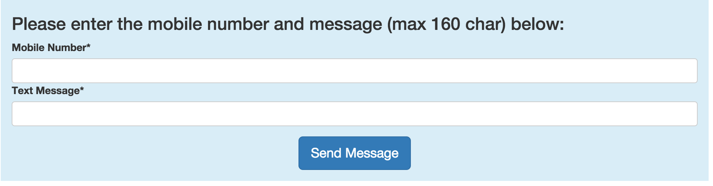

# Twilio-SMS-Lightning-Component

Twilio SMS Lightning component lets users to send a sms from inside Salesforce in the browser
or in the Salesforce1 app.

You need:

  1. A valid Twilio (premium or developer) account
  2. [Twilio for Salesforce library](https://www.twilio.com/docs/salesforce/install)
  3. Salesforce org with Lightning Components and App Builder enabled

You can access the component by configuring and adding it to an app using the Lightning App Builder.
